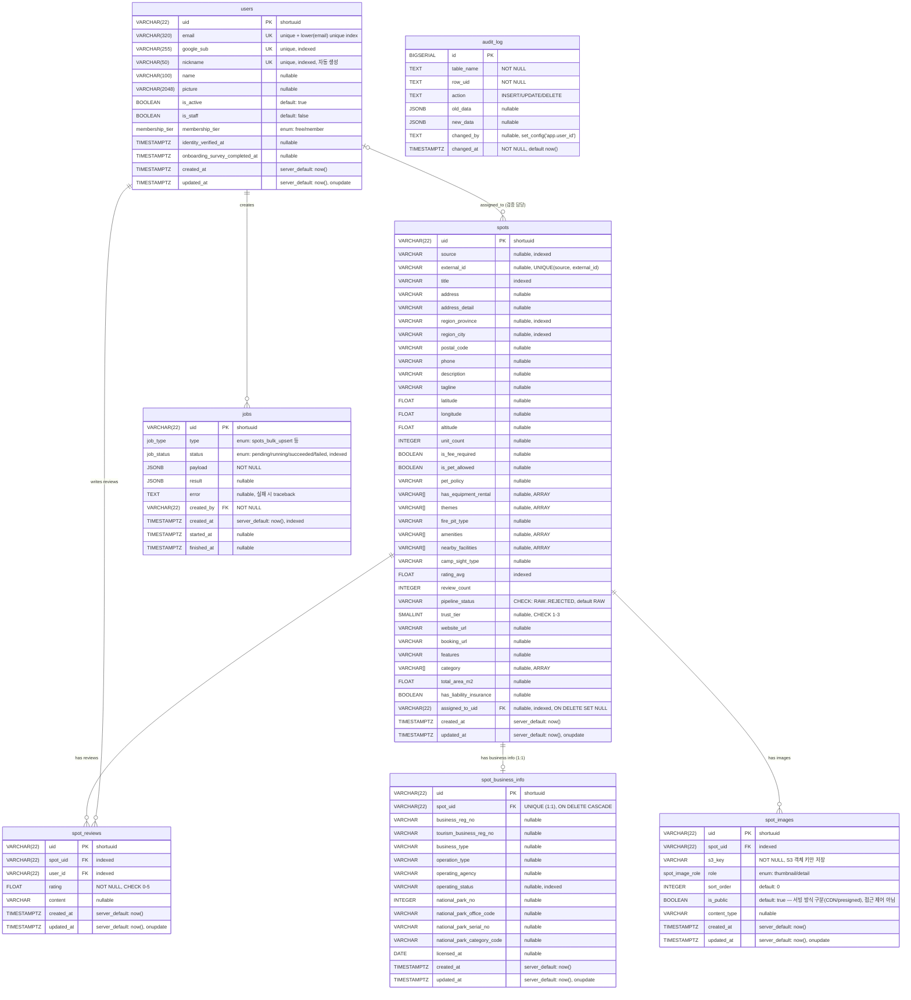

# VIVAC API - Database ERD

> Entity Relationship Diagram (Mermaid)
>
> GitHub, VS Code(Markdown Preview Mermaid 확장) 등에서 시각적으로 렌더링됩니다.
> 원본은 `vivacapi/models/` — 모델이 바뀌면 이 문서도 함께 갱신한다.

모든 도메인 테이블의 PK는 shortuuid 22자 문자열(`VARCHAR(22)`)이며
`^[0-9A-Za-z]{22}$` CHECK 제약이 걸려 있다 (`audit_log`만 bigserial).

## ERD

## Relationships

| 관계 | 설명 | FK | 제약 조건 |
|------|------|----|-----------|
| `spots` → `spot_business_info` | **1:1** | `spot_business_info.spot_uid` → `spots.uid` | `UNIQUE(spot_uid)`, ON DELETE CASCADE |
| `spots` → `spot_reviews` | 1:N | `spot_reviews.spot_uid` → `spots.uid` | `UNIQUE(spot_uid, user_id)` |
| `spots` → `spot_images` | 1:N | `spot_images.spot_uid` → `spots.uid` | - |
| `users` → `spot_reviews` | 1:N | `spot_reviews.user_id` → `users.uid` | 유저당 스팟별 리뷰 1개 |
| `users` → `spots` | 1:N | `spots.assigned_to_uid` → `users.uid` | nullable, ON DELETE SET NULL |
| `users` → `jobs` | 1:N | `jobs.created_by` → `users.uid` | - |

`audit_log`는 FK 없이 `(table_name, row_uid)` 텍스트로 대상 행을 가리킨다 —
원본 행이 삭제돼도 이력이 남아야 하기 때문.

## Constraints

| 테이블 | 이름 | 타입 | 설명 |
|--------|------|------|------|
| 전 도메인 테이블 | `ck_<table>_uid_format` | CHECK | `uid ~ '^[0-9A-Za-z]{22}$'` (shortuuid 문자셋) |
| `users` | `ix_users_email_lower` | UNIQUE INDEX | `lower(email)` — 케이스만 다른 중복 계정 방지 |
| `spots` | `uq_spots_source_external_id` | UNIQUE | `(source, external_id)` — bulk upsert 키 |
| `spots` | `ck_spots_pipeline_status` | CHECK | RAW/ENRICHED/CURATED/REVIEWED/PUBLISHED/REJECTED |
| `spots` | `ck_spots_trust_tier` | CHECK | `trust_tier BETWEEN 1 AND 3` |
| `spot_reviews` | `uq_spot_user_review` | UNIQUE | `(spot_uid, user_id)` |
| `spot_reviews` | `check_review_rating_range` | CHECK | `rating >= 0 AND rating <= 5` |

## Indexes

| 테이블 | 컬럼 | 용도 |
|--------|------|------|
| `users` | `email`, `google_sub`, `nickname` | 로그인 매칭, 닉네임 중복 검사 |
| `spots` | `title`, `source`, `region_province`, `region_city`, `rating_avg`, `assigned_to_uid` | 검색/필터/정렬/My Queue |
| `spots` | `ix_spots_published_uid` (partial: `pipeline_status='PUBLISHED'`) | 공개 목록 커서 페이지네이션 |
| `spot_business_info` | `operating_status` | 운영 상태 필터 |
| `spot_reviews` | `spot_uid`, `user_id` | 스팟별/유저별 리뷰 조회 |
| `spot_images` | `spot_uid` | 스팟별 이미지 조회 |
| `jobs` | `status`, `created_at` | 워커 claim (PENDING 오래된 순) |
| `audit_log` | `(table_name, row_uid, changed_at)` | 행 단위 이력 조회 |

## Audit Triggers

`spots`, `spot_business_info`에 AFTER INSERT/UPDATE/DELETE 트리거(`log_audit()`)
가 붙어 있어 변경 전/후 스냅샷을 `audit_log`에 기록한다. 변경 주체는 앱이
트랜잭션에서 `set_config('app.user_id', <uid>, true)`로 주입한다
(미주입 시 NULL). 새 테이블을 감사 대상에 추가하려면 트리거만 부착하면 된다
(`alembic/versions/b7f3a1c9d2e4` 참고).
